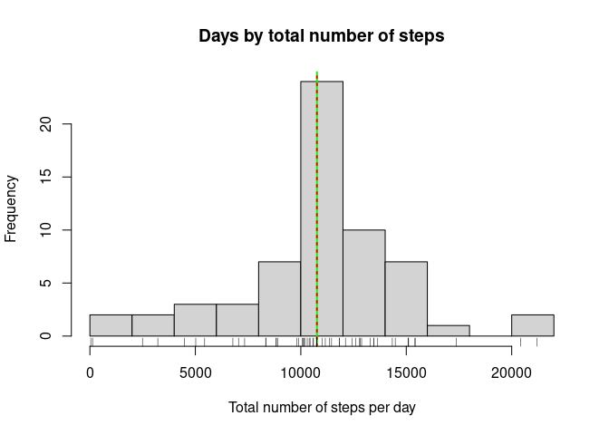

## Loading and preprocessing the data

This code reads the activity.csv file and stores it as a data frame. If the activity.csv file is not yet present, it extracts it from the provided zip file.


```r
if(!file.exists('activity.csv')){
    unzip('activity.zip')
}
data <- read.csv('activity.csv', sep=',' , header=TRUE)
```


## What is mean total number of steps taken per day?

The code below calculates the total number of steps per day and the mean and median total number of steps across the days for which there are data in the data set.

Total number of steps per day:

```r
steps_per_day <- aggregate(steps~date, data=data, sum)
print(steps_per_day)
```

```
##          date steps
## 1  2012-10-02   126
## 2  2012-10-03 11352
## 3  2012-10-04 12116
## 4  2012-10-05 13294
## 5  2012-10-06 15420
## 6  2012-10-07 11015
## 7  2012-10-09 12811
## 8  2012-10-10  9900
## 9  2012-10-11 10304
## 10 2012-10-12 17382
## 11 2012-10-13 12426
## 12 2012-10-14 15098
## 13 2012-10-15 10139
## 14 2012-10-16 15084
## 15 2012-10-17 13452
## 16 2012-10-18 10056
## 17 2012-10-19 11829
## 18 2012-10-20 10395
## 19 2012-10-21  8821
## 20 2012-10-22 13460
## 21 2012-10-23  8918
## 22 2012-10-24  8355
## 23 2012-10-25  2492
## 24 2012-10-26  6778
## 25 2012-10-27 10119
## 26 2012-10-28 11458
## 27 2012-10-29  5018
## 28 2012-10-30  9819
## 29 2012-10-31 15414
## 30 2012-11-02 10600
## 31 2012-11-03 10571
## 32 2012-11-05 10439
## 33 2012-11-06  8334
## 34 2012-11-07 12883
## 35 2012-11-08  3219
## 36 2012-11-11 12608
## 37 2012-11-12 10765
## 38 2012-11-13  7336
## 39 2012-11-15    41
## 40 2012-11-16  5441
## 41 2012-11-17 14339
## 42 2012-11-18 15110
## 43 2012-11-19  8841
## 44 2012-11-20  4472
## 45 2012-11-21 12787
## 46 2012-11-22 20427
## 47 2012-11-23 21194
## 48 2012-11-24 14478
## 49 2012-11-25 11834
## 50 2012-11-26 11162
## 51 2012-11-27 13646
## 52 2012-11-28 10183
## 53 2012-11-29  7047
```

Mean number of steps per day:

```r
mean_steps <- mean(steps_per_day$steps)
print(mean_steps)
```

```
## [1] 10766.19
```

Median number of steps per day:

```r
median_steps <- median(steps_per_day$steps)
print(median_steps)
```

```
## [1] 10765
```

And below is a histogram of the total number steps per day for the period provided in the data set with a full green line indicating the mean and a dotted red line indicating the median. As is evident from this graph, and from the numbers above, the median and mean are almost identical.

```r
hist(steps_per_day$steps, 
     breaks = 15, 
     xlab='Total number of steps per day', 
     main='Days by total number of steps')
abline(v=mean_steps, col='green', lwd=2)
abline(v=median_steps, col='red', lwd=2, lty=3)
rug(steps_per_day$steps)
```

<!-- -->


## What is the average daily activity pattern?

The graph below shows the daily activity pattern as indicated by the number of steps taken during 5 minute intervals over the course of the day and averaged over all the days in the data set. The interval with the maximum amount of activity is indicated by a vertical green line and the mean activity during this interval is indicated by a horizontal red line.

```r
steps_per_int <- aggregate(steps~interval, data=data, mean)
max_steps_amount <- max(steps_per_int$steps)
max_steps_int <- which(steps_per_int$steps == max_steps_amount)
plot(steps_per_int$steps, 
     type='l', 
     xlab='5 min time intervals in a day', 
     ylab='Average amount of steps', 
     main='Average daily activity pattern(steps per 5 min time interval)')
abline(h=max_steps_amount, col='red', lwd=2)
abline(v=max_steps_int, col='green', lwd=2)
```

<!-- -->

The interval with the highest mean amount of steps is:

```r
print(max_steps_int)
```

```
## [1] 104
```

And the mean amount of steps during this interval is:

```r
print(max_steps_amount)
```

```
## [1] 206.1698
```


## Imputing missing values

The following code chunck creates a new data frame where all na values have been filled, using the mean amount of steps during the same time interval for the other days in the data set for which data are available.

```r
na_data <- sum(is.na(data$steps))
data_na_fill <- data
time_intervals <- unique(data$interval)
for (i in 1:length(time_intervals)){
	dat_int <- data_na_fill[data_na_fill$interval == time_intervals[i],]
	mean_int <- mean(dat_int$steps, na.rm=TRUE)
	data_na_fill[data_na_fill$interval == time_intervals[i],]$steps[is.na(dat_int$steps)] <- mean_int
}
```

Now let's redo the first exercise, calculating the total number of steps per day and their mean and median values and check for differences between the raw data and the new data with missing data filled in.
After calculating the amount of steps per day with missing data filled in, the new mean value is:

```r
steps_per_day_fill <- aggregate(steps~date, data=data_na_fill, sum)
mean_steps_fill <- mean(steps_per_day_fill$steps)
print(mean_steps_fill)
```

```
## [1] 10766.19
```

The new median value with filled in missing data is:

```r
median_steps_fill <- median(steps_per_day_fill$steps)
print(median_steps_fill)
```

```
## [1] 10766.19
```

And the new version of the histogram with filled in missing data looks like this.

```r
hist(steps_per_day_fill$steps, breaks = 15, xlab='Total number of steps per day', main='Days by total number of steps')
abline(v=mean_steps_fill, col='green', lwd=2)
abline(v=median_steps_fill, col='red', lwd=2, lty=3)
rug(steps_per_day_fill$steps)
```

<!-- -->

As both the calculated mean and median values and the histogram show, the differences between the raw data and the data with filled in missing values are negligible. The mean value hasn't changed at all and the median value which was almost identical to the mean before is now exactly identical. The shape of the histogram also hasn't changed in any meaningful way.


## Are there differences in activity patterns between weekdays and weekends?
Now let's compare the daily activity pattern between weekdays and weekend days to see if there are differences. In order to achieve this, we need to create a new weekday column in our data frame and use these as an index to calculate mean activity per 5 minute interval for weekdays and weekend days. To compare these we need to create two separate graphs.

```r
data_na_fill$weekday <- weekdays(as.Date(data_na_fill$date))
weekend <- data_na_fill$weekday == 'Saturday' | data_na_fill$weekday == 'Sunday'
steps_per_int_week <- aggregate(steps~interval, data=data_na_fill[!weekend,], mean)
steps_per_int_weekend <- aggregate(steps~interval, data=data_na_fill[weekend,], mean)
par(mfrow = c(2, 1))
plot(steps_per_int_week$steps, 
     type='l', 
     xlab='5 min time intervals in a day', 
     ylab='Average amount of steps', 
     main='Average daily activity pattern weekday')
plot(steps_per_int_weekend$steps, 
     type='l', xlab='5 min time intervals in a day', 
     ylab='Average amount of steps', 
     main='Average daily activity pattern weekend day')
```

<!-- -->

